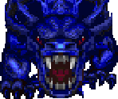
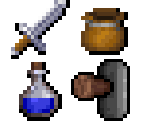
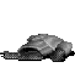
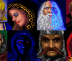

Dungeon Hack Tile Extraction
============================

* Unpack the .RES file
  * Run `daesop.exe /i HACK.RES hack.txt` to get a list of resources and their numbers
  * Run `daesop.exe /x HACK.RES <id> <outfilename>` on each (relavant) file (see `tools/extract.bat` as an example)
* Filter down to just images - originally just tried to load each image and kept those that didn't fail to parse
  * See `tools/imagelist.txt` for that set
* Copy the extracted fonts into `fonts/` as `8x8_font` and `ornate_font`
* Copy `Main_Base_Palette.out`, `Diff_Base_Palette.out`, and `wall_floor_palette*.out` into `palettes/`
* Install Node.js and run `npm install`
* Run `node --expose-gc proc.js` to convert and categorize all images
* Run `node --expose-gc makerows.js` to combine related images into a single image with labels and rows - may want to tweak some options at the end of that file
* Run `node makesheet.js` to combine rows into a tilesheet with a header